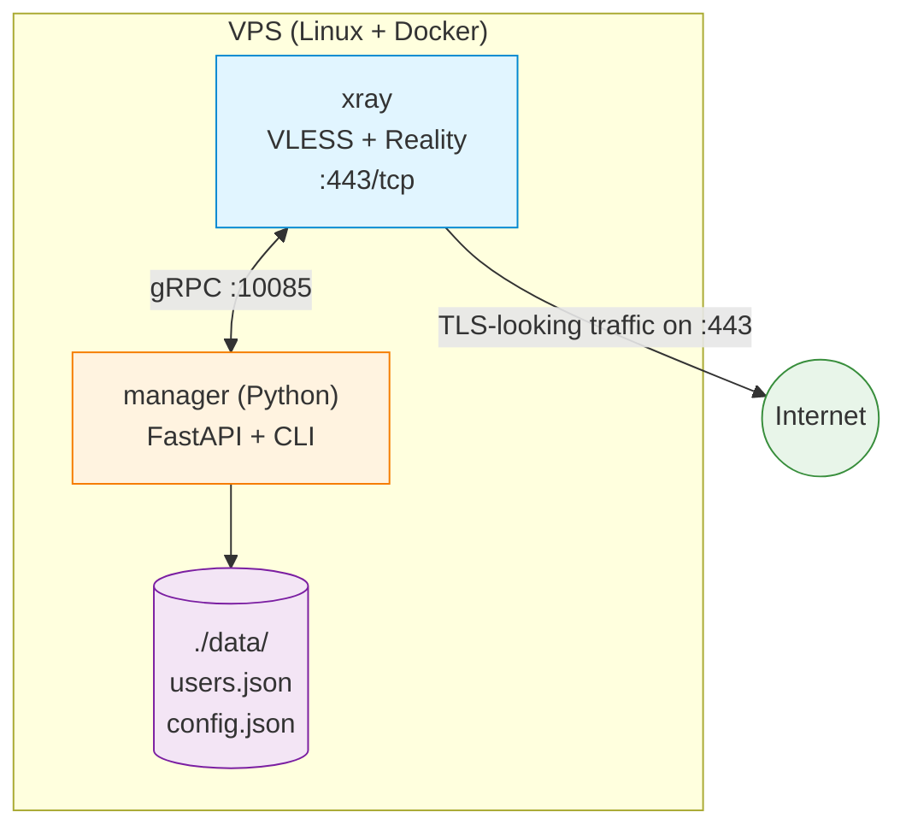

# Architecture

## Overview

This project provides a self-hosted VPN node based on
[Xray-core](https://github.com/XTLS/Xray-core), exposed via the
**VLESS + Reality** protocol.

A node consists of three components running together via Docker Compose:

## Components

### xray
The actual VPN server. Listens on `0.0.0.0:443` for incoming VLESS+Reality
connections. Configuration is generated from a template at startup based on
environment variables and persisted to `./data/xray/config.json`.

### manager
A Python service that exposes:

- **CLI** — `vpn-user add|remove|list|show|sync` for human operators.
- **gRPC client** — talks to xray's internal API on `127.0.0.1:10085` for
  zero-downtime user CRUD operations.
- **Future: HTTP API** (v0.75) for issuing subscription URLs to clients.

State (users, their UUIDs, creation dates) lives in `./data/users.json`.
This file is the source of truth and is what gets backed up.

### Persistent state — `./data/`
Everything mutable lives in this directory:
- `xray/config.json` — generated Xray config (regenerated on `make init`).
- `users.json` — user database.

This directory is `.gitignore`d and must be backed up out-of-band.

## Networking

The VPN node uses `network_mode: host` for the Xray container so that traffic
on `:443` is exposed directly without Docker's userland NAT. The manager
container also runs on host networking to reach xray's loopback API at
`127.0.0.1:10085`.

The server's firewall (UFW) only opens:
- `:22/tcp` — SSH
- `:443/tcp` — VLESS+Reality

## Security model

- All secrets (Reality private key, short ID) are generated on the server at
  `make init` and never leave it. They are written to `.env` (gitignored).
- The xray gRPC API binds to `127.0.0.1` only, never exposed externally.
- User UUIDs serve as both identifier and authentication token; they should
  be treated as bearer credentials.